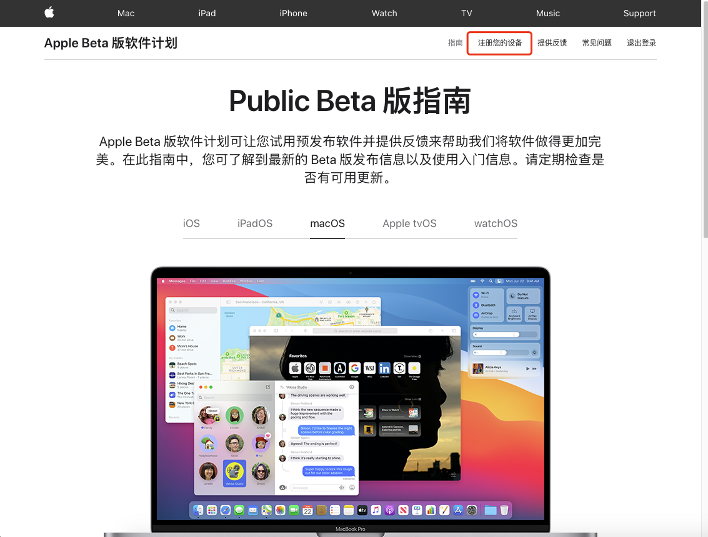
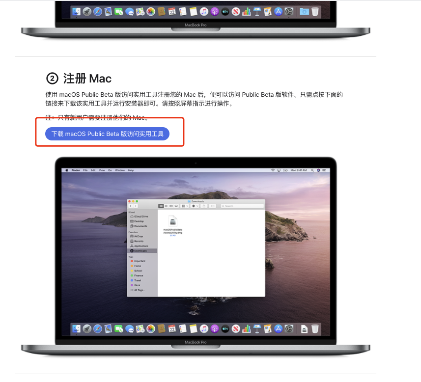
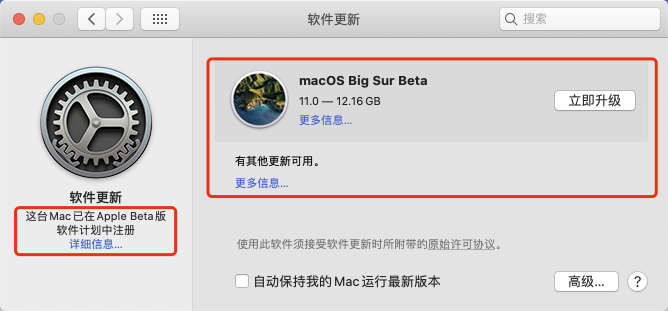
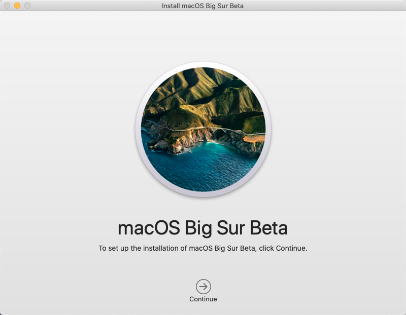

# Big Sur Beta 7 黑苹果安装记录
## 前言
Bug Sur已经到了 Public Beta 7 真正是Big Sur了

所以来体验一下

开始时间 2020-09-18 13:50

## 参考

- 视频

  - up主: 司波图

    - [Intel Coffee Lake平台完美黑苹果系统安装教程（Opencore+Catalina15.4）](https://www.bilibili.com/video/BV1hA411t7dr)
  
      OpenCore入门看的视频
  
  - up主: 大头蔡Cass
    - [ 全新安装macOS Big Sur，一机多系统，翻倍的快乐！](https://www.bilibili.com/video/BV13f4y1D7KZ?from=search&seid=16920761760245886312)

- 文章

  - [Dortania's OpenCore Install Guide](https://dortania.github.io/OpenCore-Install-Guide/)

    最权威的OpenCore 教程, 没有之一, 跟着教程做一遍就已经成功了百分之90%

- 软件

  获取ACPI

  生成 SMBIOS 信息

  OpenCore配置编辑器:properTree.

  gibMac: 下载macOS 镜像

  Clover Configurator: 仅仅用于挂载EFI分区. 不能用来编辑OpenCore配置文件.

  

## 1. 原版镜像制作
参考: 

[ [文章] How to Install the macOS Big Sur Public Beta](https://www.macrumors.com/how-to/install-macos-big-sur-public-beta/)

### 1.1 注册 Big Sur 测试资格
打开 [Apple Beta Software Program website](https://beta.apple.com/sp/betaprogram/)

登录Apple ID 同意协议 然后在主界面 点击 注册您的设备



需要下载一个软件: macOS Public Beta 版访问实用工具 并安装



### 1.2 下载镜像并制作安装盘

安装好之后系统会自动检查更新, 然后点击立即升级



看到这系统大小 12.16GB, 10M的宽带瑟瑟发抖, 需要六小时.

然后还是掏出了笔记本到教学楼下载. 3: 05分开始下载

到4:00 下载好了. 但是系统提示下载的升级包不完整.白费一小时.只能再次下载.

4:01 再次开始下载.4:28再次出错.因为校园网断网了.

4:34 再次重新下载

5: 31 终于下载成功



下载过程中想起来一个b站up主的视频, 参考意义很大.


[ 全新安装macOS Big Sur，一机多系统，翻倍的快乐！](https://www.bilibili.com/video/BV13f4y1D7KZ?from=search&seid=16920761760245886312)

跟着视频做, 制作好USB安装盘

以下内容来自于视频

1. 打开磁盘管理工具, 抹掉U盘.记得U盘命名为USB, 这样后面的命令才能直接使用

2. 打开终端输入命令

   ```sh
   sudo /Applications/Install\ macOS\ Big\ Sur\ Beta.app/Contents/Resources/createinstallmedia --volume /Volumes/USB
   ```

   输入密码, 输入y 回车, 开始制作, 这部分时间较长, 估计二十分钟以上.

等待一段时间后终端提示

Install media now available at "/Volumes/Install macOS Big Sur Beta"

制作安装盘完成

## 2. 安装

### 2.1 升级EFI

之前用的macOS Catalina 10.15.6 升级Big Sur之前要先升级Opencore.

刚刚那个up主有升级Opencore的视频教程, 如下

[【黑苹果必备技能】02：升级OpenCore（OC）引导](https://www.bilibili.com/video/BV1Ka4y1j7Ey)

但我使用另外一个工具, [OC-Gen-X](https://github.com/Pavo-IM/OC-Gen-X) 来生成EFI文件

由于OC-Gen-X没有加入NvmeFix, 去Github找到最新的驱动 手动添加到kext文件夹中, 

然后复制以前的ACPI文件到ACPI目录下.

再用 properTree打开 config.plist, 然后按住 cmd + shitf + r 选择OpenCore根目录, 点击确定后, properTree 会在配置文件中加入ACPI和kext的信息.

复制之前的 SMBIOS 信息到 config.plist 设备信息 下.

备份 10.15.6 的 EFI文件夹.

重启, 能顺利进入 10.15.6 系统. 试试各项功能是否正常. 没出错的话. 进入下一步, 安装Big Sur

### 2.2 Big Sur 安装

重启后在 OpenCore 选择启动项界面 选择 install macOS Big Sur Beta

 接着开始跑代码. 两分钟后.

那个熟悉的 苹果 图标出现了

接着修改分区 我用的 128g + 256gb 两个固态硬盘 

128g的 win10系统使用. 

256gb的:

分区1: 原本分给10.15.6 系统150g, 减少容量到125GB

分区2(macOS Big Sur Beta 7): 111 GB 分给 Big Sur. 后期Big Sur 稳定后再把 10.15.6的格式化了 给它扩容.

 分区3: 分给win和mac系统通用盘(exfat格式) 20gb, 用来存代码.


分区好了之后 进入安装, 安装磁盘选择 macOS Big Sur Beta 7 千万不能选错, 否则之前的10.15.6的系统会没了. 安装开始后就是等待, 这个时候可以找点其他事情做. 


进度条跑到五分之四后显示器黑屏无信号了, 键盘还亮着.多等了几分钟, 后来电脑重启了.

之后选择 macOS Installer 启动项. 接着又是漫长的等待. 再一次重启跑码最后进了系统.

