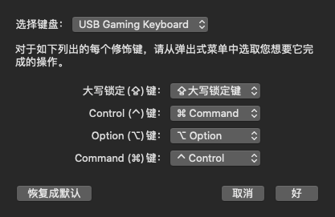
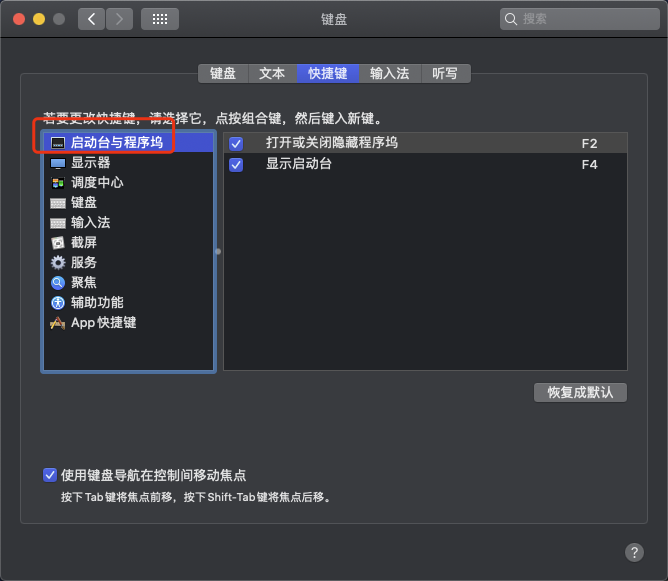
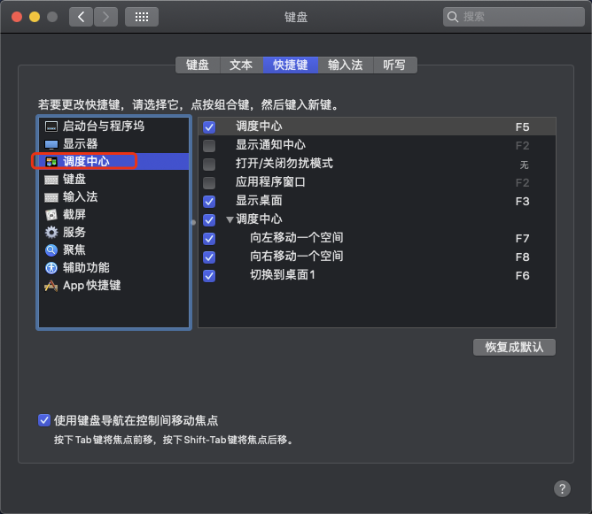

# Opencore

自用台式电脑 macOS 10.15.6 配置
opencore 0.5.8 debug version

## 电脑配置

电脑型号 微星 MS-7B23 台式电脑

处理器 英特尔 Core i3-8100 @ 3.60GHz 四核

主板 微星 B360M BAZOOKA PLUS (MS-7B23) ( B360 芯片组 )

显卡 Nvidia GeForce GTX 1050 Ti ( 4 GB / 微星 )

内存 8 GB ( 芝奇 DDR4 2666MHz )

主硬盘 西数 WDC WDS120G2G0A-00JH30 ( 120 GB / 固态硬盘 )

显示器 XMD004A Mi TV ( 55.2 英寸 )

声卡 英特尔 High Definition Audio 控制器

网卡 英特尔 Ethernet Connection I219-V / 微星

## 介绍

macOS: 核显 DP 输出

Win10: 独显 HDMI 输出

Win10下 设置仅独显输出

10.15.6 在 10.13.6 版本上增加启动参数 屏蔽了独显, 否则进不去安装


# 其他

## 用到的软件

1. [ProperTree](https://github.com/corpnewt/ProperTree)
2. [clover 配置软件](https://mackie100projects.altervista.org/download-clover-configurator/）
3. [hackintool](https://github.com/headkaze/Hackintool/releases)

只用来挂载 efi 分区， 千万不能用来编辑

opencore 的 config.plist

opencore 的需要用 ProperTree 编辑

## opencore 引导配置

参考：

1. [Intel Coffee Lake 平台完美黑苹果系统安装教程](https://www.bilibili.com/video/BV1hA411t7dr)
2. [OpenCore-Desktop-Guide](https://dortania.github.io/OpenCore-Desktop-Guide/)
   上面的视频教程用到的文字教程

## 一些系统设置/偏好设置

1. 解除安装/软件运行限制

```shell script
sudo spctl --master-disable
```

2. 鼠标滚动方向保持与 windows 一致
   设置--> 鼠标 --> 滚动方向：自然。 取消勾选
3. qq 截图
   左上角 qq --> 偏好设置 --> 截取屏幕

cmd(win) + alt + a

4. 百度输入法设置输入中文时使用英文符号

左键点击百度输入法 --> 偏好设置 --> 勾选 中文时使用英文符号

5. 键盘快捷键设置

1. 系统偏好设置 --> 键盘 --> 修饰键 --> 



​		ctrl和cmd(win)互换

2. 系统偏好设置 --> 键盘 --> 快捷键

   

   

F1: 暂无

F2: 打开和关闭隐藏程序坞

F3: 显示桌面

F4: 显示启动台

F5: 调度中心

F6: 切换到桌面1

F7: 向左移动一个空间

F8: 向右移动一个空间

## 驱动

### 声卡驱动

参考:

- [Fixing audio with AppleALC](https://dortania.github.io/OpenCore-Post-Install/universal/audio.html#finding-your-layout-id)

我的声卡是 alc 892

填入 lay-out id 12

(为什么不是 1,2 等 看下面的)

hackintool 查看 声卡地址 注意要看厂商为 intel 的

PciRoot(0x0)/Pci(0x1F,0x3)--> layout-id data 12000000

要四个字节(八位数) 16 进制

删除 nvme 下 7c 开头下的 boot-args 中的 alcid=12(这个是用于测试的 测试完毕就改为到配置文件里去)

#### 遇到的坑

导致花了一天的时间测试 lay-out id 结果发现 HDMI 都没输出声音

当我修改 lay-out-id = 12 时

推测应该是驱动上了, 主板上有声音 显卡上没 HDMI 输出声音而已

想到了这一点后我想用有线耳机测试主板的声音输出, 但手头没有线耳机

只有用几个月前在淘宝买的[mac 免驱蓝牙](https://item.taobao.com/item.htm?spm=a1z09.2.0.0.3ba42e8dwlfgaA&id=595573828080&_u=r1nlumvm9c0b)

搭配蓝牙耳机测试,有声音

接下来需要看怎么让独显 HDMI 也输出声音

## 问题

### 关机变重启

进bios设置唤醒事件为bios控制而不是操作系统控制

### hdmi核显没输出

黑果小兵教程说加缓冲帧, 没有尝试

### win mac 系统时间不同步 且时间经常改变

参考: https://zhuanlan.zhihu.com/p/72871207

1. 装好系统后, 进win10 cmd 管理员模式运行命令

```cmd
Reg add HKLM\SYSTEM\CurrentControlSet\Control\TimeZoneInformation /v RealTimeIsUniversal /t REG_DWORD /d 1
```

2. 重置bios
   用螺丝刀短接主板电池旁边的接线柱15s,大概这意思.我的主板电池在显卡下面
   
   然后重新设置bios选项


